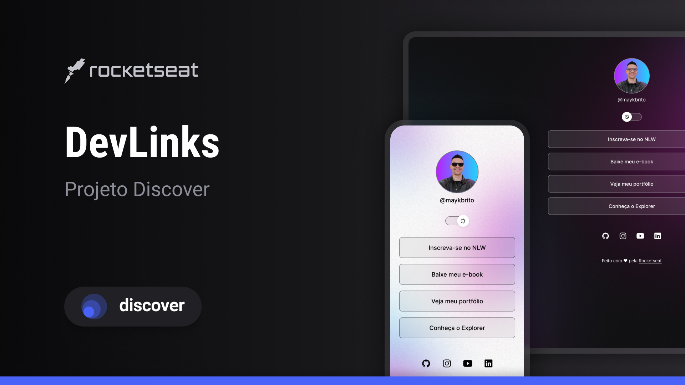

# DevLinks

> Trilha Explorer

Projeto construído atravéz do Discover da Rocketseat.

[🔗 Clique aqui para acessar](https://maykbrito.github.io/nlw-esports-explorer/)

## 🛠 Tecnologias

- HTML e CSS
- Javascript
- Figma
- Git e Github

## 💻 Projeto

O DevLinks é um agregador de links para usar como cartão de visitas online.

## 🔖 Layout

Você pode visualizar o layout do projeto através [desse link](https://www.figma.com/community/file/1187422022288947321). É necessário ter conta no [Figma](https://figma.com) para acessá-lo.

## :memo: Licença

Esse projeto está sob a licença MIT

---

Feito com ♥ by Rocketseat :wave: [Participe da nossa comunidade!](https://discord.gg/rocketseat)
